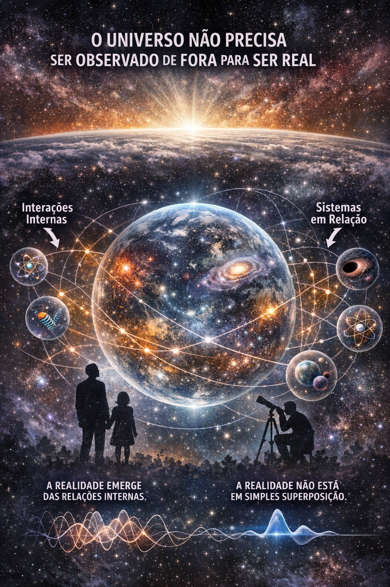

# Realidade, Observação e Universo como Sistema

Se considerarmos o **Universo como um sistema físico completo**, tudo o que existe faz parte dele — inclusive nós, os observadores. Isso implica que **não existe um “observador externo” ao Universo**, já que qualquer observação possível ocorre _dentro_ do próprio sistema universal.

Na mecânica quântica tradicional, um sistema entra em **superposição** até que um observador o meça. Porém, quando o próprio observador é parte do sistema, essa distinção entre **“sistema”** e **“observador”** deixa de ser absoluta. O que chamamos de observação passa a ser, na verdade, **interações internas entre subsistemas do Universo**.

Desse modo, a realidade **não depende de alguém fora do Universo** para “colapsar” seus estados. Os estados do Universo se definem **relacionalmente**, isto é, a partir das interações entre suas próprias partes. Cada sistema observa outros sistemas, e essa **rede de relações** constrói o que chamamos de realidade.

Quando observamos o passado — por exemplo, pela luz que chega até nós — estamos vendo **estados já definidos no presente por interações anteriores**, e não um passado em superposição. Assim, embora a superposição seja fundamental em níveis microscópicos, a realidade como um todo **não está em uma superposição simples e indefinida**, mas em estados consistentes que emergem dessas interações internas contínuas.

---

## Conclusões

### 1. O Universo não precisa ser observado “de fora” para ser real

Não existe um “fora” do Universo. A realidade se sustenta pelas **interações internas entre seus próprios sistemas**.

### 2. A realidade emerge das relações internas entre sistemas

Observação não é algo mágico ou externo, mas o **resultado de interações físicas** entre partes do próprio Universo.

### 3. A realidade não está numa simples superposição

Embora a superposição exista em nível quântico, o conjunto da realidade assume **estados definidos por meio dessas interações**, indo além de uma superposição pura e indefinida.

